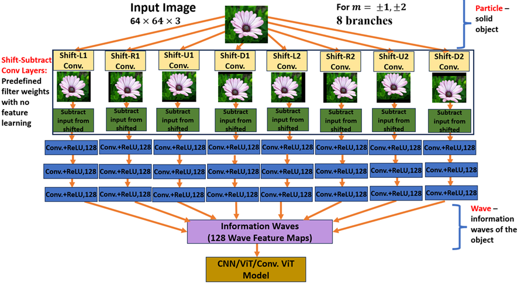

## 📖 Quantum Vision (QV) Theory in Deep Learning

Inspired by quantum physics, **Quantum Vision (QV)** theory introduces a completely new perspective for object recognition using deep learning.  

QV takes captured still images of objects and converts them into **information wave functions** using a deep learning module called the **QV Block**.  

The QV Block can be integrated into:
- Convolutional Neural Networks (CNNs)
- Vision Transformers (ViTs)
- Convolutional Vision Transformers (CvTs)

These integrations produce **QV model variants** for object classification.

### 🔬 Key Highlights
- Converts image data into information wave functions.
- Enhances existing vision architectures by integrating the QV Block.
- Demonstrated **consistent performance improvements** across multiple datasets compared to standalone models.
- Easy Python API for quick experimentation

## 🐍 Python Usage

### 🛠️ Installation
```bash
# Install via pip (will be available soon on PyPI)
pip install vindioai

```
### 🚀 Integrating QVBlock into Your Deep Learning Model (Check the CNN, ViT and CvT integration codes for more details)

```python
import vindioai
from vindioai import QVBlock, Init_Freeze_ShiftSubtract_Layers

# default wave is 128. For more computationally efficient training, wave values can be reduced to 64, 32, 16, 8
wave=128

# For small image size (64, 64 , 3) use momentum_direction of either [1] or [1, 2].
#[1] creates 4 parallel branches, while [1, 2] created 8 parallel branches

# For large image sizes (224, 224 , 3) use momentum_direction of either [2] or [2, 4]
#[2] creates 4 parallel branches, while [2, 4] created 8 parallel branches

momentum_direction=np.array([1, 2])

# Get QV Block
QV_block = QVBlock(momentum_direction=momentum_direction, input_shape=(64, 64, 3), conv_layers=3, waves=wave)

inputs = QV_block.input
infowave = QV_block.output

# QV_block is now ready to be integrated into your deep learning model

#..... Add your layers such as
# QV INFORMATION WAVES FEED TO A CNN ARCHITECTURE OR VIT OR CvT, CNN example below

convafter1 = Conv2D(128, (3, 3), padding='same', activation=None,
             use_bias=True, name='convafter1')(infowave)

#...

output = Dense(10, activation = 'softmax')(flat)

model = Model(inputs=inputs, outputs=output)

# Must initialize and freeze the weight learning for QVBlock shift and subtract conv layers
model=Init_Freeze_ShiftSubtract_Layers(model, wave, momentum_direction=momentum_direction)

# Now compile your model as usual
model.compile(optimizer='adam', loss='sparse_categorical_crossentropy', metrics=['accuracy'])

```

### 📜 License

Quantum Vision Theory in Deep Learning for Object Recognition is licensed under the **AGPL-3.0** license for research and non-commercial use.  
You are free to use, modify, and share the code and models under the terms of the AGPL-3.0 license.
However, if you create any derivative works or deploy them (including via a network service), you must release your modifications and the full source code under the same AGPL-3.0 license.

**Commercial / Closed-source Use**  
If you want to integrate Quantum Vision Theory into a closed-source or proprietary product without releasing your source code, you must obtain an **Enterprise License** from the Vindio AI Software Ltd, https://vindioai.com/ 

📩 Contact: [info@vindioai.com] for Enterprise pricing and terms.

**License Summary**

| Use Case                                   | Free? | Must Release Source Code? | License Type           |
|--------------------------------------------|-------|---------------------------|------------------------|
| Academic / research (non-commercial)       | ✅ Yes | ✅ Yes (if modified/distributed) | AGPL-3.0               |
| Personal experiments / hobby projects      | ✅ Yes | ✅ Yes (if shared publicly) | AGPL-3.0               |
| Open-source commercial product             | ✅ Yes | ✅ Yes                     | AGPL-3.0               |
| Closed-source commercial product           | ❌ No  | ❌ No (with Enterprise License) | Enterprise License     |

**Key Point:** If you use Quantum Vision in a product or service and **do not** want to release your own source code under AGPL-3.0,  
you **must** purchase an Enterprise License.

### 📄 Citation
If you use this work, please cite our paper:

> **C. Direkoglu and M. Sah**, *"Quantum Vision Theory in Deep Learning for Object Recognition,"* IEEE Access, vol. 13, pp. 132194–132208, 2025.  
> doi: [10.1109/ACCESS.2025.3592037](https://doi.org/10.1109/ACCESS.2025.3592037)

bibtex
@article{direkoglu2025quantum,
  author={Direkoglu, Cem and Sah, Melike},
  title={Quantum Vision Theory in Deep Learning for Object Recognition},
  journal={IEEE Access},
  volume={13},
  pages={132194-132208},
  year={2025},
  doi={10.1109/ACCESS.2025.3592037}
}


### 🔬 QVBlock Architecture



